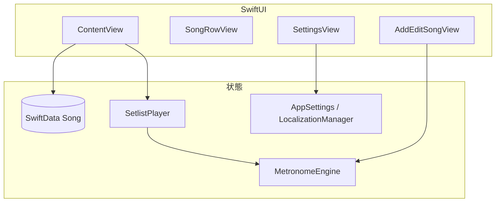

# BPM Setlist — 開発ガイド

機能追加や改修をしやすくするための、プロジェクト構成と責務の整理です。

## アプリの役割

DJ／演奏用の **セットリスト + メトロノーム**。曲ごとに BPM・拍子・再生時間（秒 / 小節 / 手動）を持ち、一覧から選んで再生し、曲間は前後ボタンや自動進行で移動します。

## 技術スタック

| 領域 | 採用 |
|------|------|
| UI | SwiftUI |
| 永続化 | SwiftData（`@Model`） |
| 音声 | AVAudioEngine + `AVAudioSourceNode`（プログラム生成クリック） |
| 設定の保存 | `@AppStorage` / `UserDefaults`（言語など） |
| 最低 OS | iOS 17.5（`project.pbxproj` の `IPHONEOS_DEPLOYMENT_TARGET`） |

Bundle ID: `com.yukohadrum.BPMSetlist`

## ディレクトリ構成（ソース）

```
BPMSetlist/
├── BPMSetlistApp.swift      # エントリ、SwiftData ModelContainer
├── ContentView.swift        # メイン画面：リスト・プレイヤーバー・CRUD 調整
├── Models/
│   ├── Song.swift           # SwiftData モデル、DurationType、時間計算
│   └── AppSettings.swift    # メトロノーム音・リスト行高・リピート・カウントイン（保存のみ）
├── Services/
│   └── MetronomeEngine.swift # MetronomeEngine + SetlistPlayer
├── Views/
│   ├── SongRowView.swift
│   ├── AddEditSongView.swift
│   ├── BeatIndicatorView.swift
│   └── SettingsView.swift
├── Theme/Theme.swift        # AppTheme（色・タイポ・スペーシング）、ButtonStyle
├── Localization/
│   └── LocalizationManager.swift  # AppLanguage、L10nKey、辞書ベース文言
└── Assets.xcassets …
```

テストターゲット `BPMSetlistTests` / `BPMSetlistUITests` は現状ほぼ Xcode テンプレートのままです。

## アーキテクチャ概要



- **データの真実**: SwiftData の `Song`。`ContentView` の `@Query(sort: \Song.order)` で取得。
- **再生ロジック**: `SetlistPlayer` が曲インデックス・経過時間・メトロノーム開始／停止をまとめる。`MetronomeEngine` は 1 クラスでオーディオと UI 向け拍表示を担当。
- **見た目**: `AppTheme` に色・余白・角丸を集約。新 UI はここを踏襲すると一貫します。
- **文言**: `LocalizationManager.shared.localized(.someKey)` と `L10nKey`。英語をフォールバックに全言語の辞書を `LocalizationManager` 内に保持。

## データモデル（Song）

`Song.swift` が中心です。

- **並び**: `order` — ドラッグ並べ替えや削除後に更新。
- **BPM**: 20…300 にクランプ。
- **拍子**: `beatsPerBar` × `beatUnit`（分母は 2/4/8/16）。
- **再生時間の意味** `DurationType`:
  - `.time` — `duration`（秒）
  - `.bars` — `durationBars`（小節数）→ `calculateDurationInSeconds()` で秒換算
  - `.manual` — タイマーなし（∞）、手動で次曲へ

**複合拍子**（例: 6/8, 9/8）と **単純拍子** で BPM の解釈と小節→秒の計算が分かれています。メトロノーム側は `MetronomeEngine.calculateAdjustedBPM`、曲の長さは `Song.calculateDurationInSeconds()` で整合を取っています。拍子まわりをいじる場合は **両方** を確認してください。

## SwiftData とマイグレーション

`BPMSetlistApp` で `Schema([Song.self])` を構築。コンテナ生成に失敗した場合、**既定ストアを削除して再作成**するフォールバックがあります（開発向けの実装）。スキーマ変更（プロパティ追加など）を本番向けに丁寧にやるなら、バージョン付けマイグレーション戦略の検討が必要です。

新しい `@Model` を足すとき:

1. `Schema([...])` に追加
2. 必要ならマイグレーション設計を見直し

## 再生の流れ（SetlistPlayer）

| 操作 | ざっくり |
|------|----------|
| `loadSongs` | `order` でソートしたコピーを保持 |
| `play(at:)` | 曲切替、メトロノーム `start`、`.manual` 以外なら 1 秒タイマーで経過と自動 `next()` |
| `next` / `previous` | 端では `isRepeatEnabled` でループ |
| `stop` | タイマー停止 + メトロノーム停止 |

`progress` / `remainingTime` は `elapsedTime` と `calculateDurationInSeconds()` から算出。

## MetronomeEngine

- `AVAudioSourceNode` のレンダラでクリック波形を生成。
- 拍アクセントは `beatsPerBar` に同期。
- 中断通知でエンジンを再セットアップする処理あり。
- `MetronomeSound`（`AppSettings`）は周波数の違いで音色を変えるだけで、サンプルファイルは未使用。
- UI 連動用の publish:
  - `currentBeat`: 現在の拍位置（0 オリジン、小節内）。停止時 0。
  - `beatTick`: 拍ごとに単調増加するカウンタ。SwiftUI の `onChange(of:)` を安定発火させるためのトリガー（`beatsPerBar == 1` 等で `currentBeat` が変化しないケース対策）。ビジュアルインジケータのパルスに使用。

## UI の拡張ポイント

| やりたいこと | 触るファイルの目安 |
|--------------|-------------------|
| 一覧・下部プレイヤー | `ContentView.swift` |
| 行の表示・スワイプ等 | `SongRowView.swift` |
| 曲の入力項目 | `AddEditSongView.swift` + `Song` |
| アプリ設定項目 | `SettingsView.swift` + `AppSettings.swift` |
| 拍の視覚表示 | `BeatIndicatorView.swift`（`engine.beatTick` をトリガーに発光） |
| 色・フォント・余白 | `Theme.swift` |
| 文言 | `LocalizationManager.swift`（`L10nKey` 追加 → 各言語辞書） |

## 設定（AppSettings）の注意

`@AppStorage` で永続化されている例:

- `selectedSound`, `listItemSize`, `isRepeatEnabled`, `countInBars`, `isVisualBeatEnabled`

`countInBars` は **UI と保存まではあるが、`SetlistPlayer` / `MetronomeEngine` では未使用**です。カウントイン機能を入れるなら、再生開始前に無音または弱い拍を挿入するなどの処理を `SetlistPlayer` 側に追加する必要があります。

`isVisualBeatEnabled` は下部プレイヤーバーの **ビジュアルビートインジケータ**（`BeatIndicatorView`）の表示 ON/OFF を切り替えます。既定 ON。イヤホンを使えない状況でも拍を視認できるようにするのが目的で、拍 1 は `accentGold`、他拍は白系で発光します。全画面フラッシュや LED トーチ連動は未実装（将来拡張候補）。

`SetlistPlayer` の `isRepeatEnabled` は `AppSettings.shared` と同期しますが、起動時に **設定から Player に読み込む**コードは `ContentView` にないので、初回表示とプレイヤー状態の同期を厳密にしたい場合は要検討です。

## ローカライズ

- 自動の `Localizable.strings` ではなく、**コード内辞書**。
- 新しい画面文言を足すとき: `L10nKey` に case 追加 → `translations` の各言語にキーを追加（英語は必ず）。

## テスト

単体テストは未整備です。優先しやすい候補:

- `Song.calculateDurationInSeconds()`（各拍子・エッジケース）
- `MetronomeEngine.calculateAdjustedBPM`

UI は `BPMSetlistUITests` / `ScreenshotGenerator.swift`（スクリーンショット用途）あり。

## 機能追加時のチェックリスト（簡易）

1. **モデル**: `Song` または新 `@Model` — `Schema` と将来マイグレーション。
2. **UI**: 対応する `Views/` と `AppTheme`。
3. **文言**: `L10nKey` と全言語。
4. **再生**: `SetlistPlayer` / `MetronomeEngine` / タイマーへ影響がないか。
5. **設定**: `AppSettings` と実際の動作の両方。

## 関連ドキュメント（リポジトリ内）

- `PRIVACY_POLICY.md`
- App Store / スクリーンショット用: `APP_STORE_FIX.md`, `README_SCREENSHOTS.md`, `SCREENSHOT_*.md` など

変更を入れたら、このファイルに「新しいモジュール責務」や「注意点」が増えたら追記すると、次の改修が楽になります。
